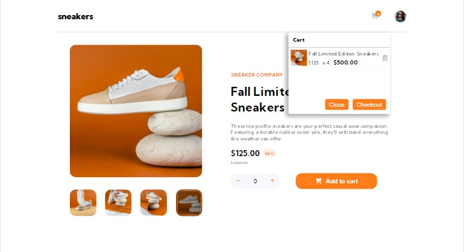

## Table of contents

- [Overview](#overview)
  - [Screenshot](#screenshot)
  - [Links](#links)
- [My process](#my-process)
  - [Built with](#built-with)
  - [What I learned](#what-i-learned)
  - [Continued development](#continued-development)
- [Author](#author)

## Overview

### Screenshot



### Links

- Solution URL: [Add solution URL here](https://your-solution-url.com)
- Live Site URL: [Add live site URL here](https://your-live-site-url.com)

## My process

### Built with

- React
- SCSS
- Flexbox
- CSS Grid
- Laptop-first workflow

### What I learned

I used this as a universal state management system

```React useContext
import React from "react";

const DisplayImageContext = React.createContext({
  src: undefined,
  onAddDisplayImage: () => {},
  items: [],
  totalAmount: 0,
  onAddToCart: (item) => {},
  onRemoveFromCart: (id) => {},
});

export default DisplayImageContext;

```

This is my general default settings for all my web apps

```scss
*,
*::after,
*::before {
  margin: 0;
  padding: 0;
  box-sizing: inherit;
}

html {
  box-sizing: border-box;
  font-size: 62.5%; //1rem = 10px

  @media only screen and (max-width: $bp-largest) {
    font-size: 56.25%; //1rem = 9px
  }
  @media only screen and (max-width: $bp-medium) {
    font-size: 50%; //1rem = 8px
  }
}
```

### Continued development

- Animations
- Universal state management
- useReducer

## Author

- Frontend Mentor - [@yourusername](https://www.frontendmentor.io/profile/yourusername)
- Twitter - [@favourejim56](https://www.twitter.com/@favourejim56)
